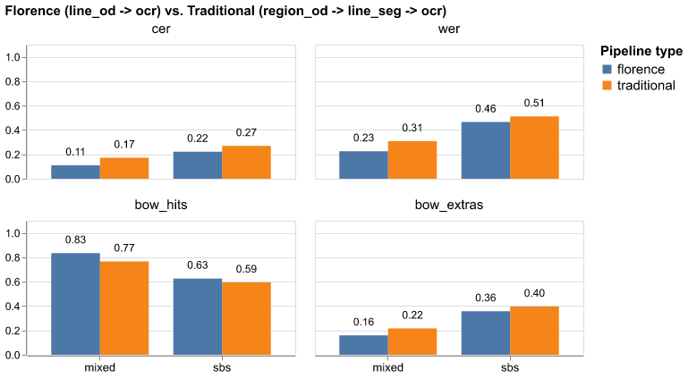
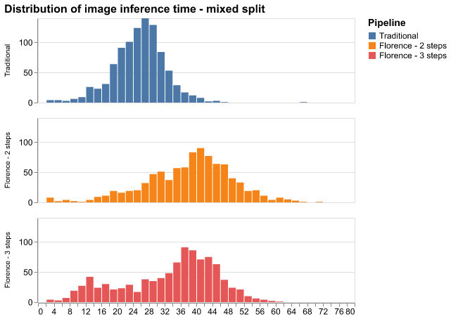

# Swedish Historical Handwritten Text Recognition with VLM

This project aims to compare a pipeline of Visual Language Models (VLMs) fine-tuned for HTR tasks against a classical pipeline using dedicated computer vision models. The project was done in collaboration with the Swedish National Archives - [Riksarkivet](https://huggingface.co/Riksarkivet).

## Demo
- [Hugging Face Space](https://huggingface.co/spaces/nazounoryuu/vlm-htr) (Currently no access to GPU, and can be turned off)
- [Local app](https://github.com/hoanghapham/vlm-htr-app): Built with Gradio, and powered the Hugging Face Space.

## Requirements

- Python version: 3.11.5
- All requirements can be found in the `requirements.txt` file.

## Comparison method

The possible tasks involved in the HTR problem are:
- Text region detection
- Text line detection
- Line segmentation
- Text recognition

I compare two pipelines with slightly different tasks, but the final outputs are still text transcription of images:
- Traditional pipeline: Text region detection -> Line segmentation within region -> Text recognition
- VLM pipeline: Text line detection -> Text recognition

Other variant pipelines are also compared. The full specifications can be found in the [thesis report](./report/thesis-report.pdf).


## Models used
- Traditional pipeline:
    - Text region detection: [yolo11m](https://docs.ultralytics.com/models/yolo11)
    - Line segmentation: [yolo11m-seg](https://docs.ultralytics.com/models/yolo11)
    - Text recognition: [TrOCR](https://huggingface.co/microsoft/trocr-base-handwritten)
- VLM Pipeline: [Florence-2](https://huggingface.co/microsoft/Florence-2-base-ft) fine-tuned for text line detection, and OCR.

## Result

The full results and discussions can be found in the [thesis report](./report/thesis-report.pdf), Chapter 4.

In terms of raw evaluation metrics (CER, WER, Bag-of-Word Hits, Bag-of-Word Extras), a Florence-based pipeline matches or even surpasses the classical pipeline. 



However, Florence requires several times more computational power to train, and even a two-step pipeline is still slower than the traditional three-step pipeline:



## Datasets:

All datasets come from [Riksarkivet's HuggingFace page](https://huggingface.co/Riksarkivet):


| **Index** | **Dataset name**                                           | **Background** | **Images** |
|-----------|------------------------------------------------------------|----------------|------------|
| 1         | [bergskollegium_advokatfiskalskontoret_seg](https://huggingface.co/datasets/Riksarkivet/bergskollegium_advokatfiskalskontoret_seg)                 | white          | 53         |
| 2         | [bergskollegium_relationer_och_skrivelser_seg](https://huggingface.co/datasets/Riksarkivet/bergskollegium_relationer_och_skrivelser_seg)              | beige          | 1,497      |
| 3         | [frihetstidens_utskottshandlingar](https://huggingface.co/datasets/Riksarkivet/frihetstidens_utskottshandlingar)                          | white          | 243        |
| 4         | [gota_hovratt_seg](https://huggingface.co/datasets/Riksarkivet/gota_hovratt_seg)                                          | beige          | 51         |
| 5         | [jonkopings_radhusratts_och_magistrat_seg](https://huggingface.co/datasets/Riksarkivet/jonkopings_radhusratts_och_magistrat_seg)                 | white          | 39         |
| 6         | [krigshovrattens_dombocker_seg](https://huggingface.co/datasets/Riksarkivet/krigshovrattens_dombocker_seg)                             | white          | 344        |
| 7         | [goteborgs_poliskammare_fore_1900](https://huggingface.co/datasets/Riksarkivet/goteborgs_poliskammare_fore_1900)                          | beige          | 5,408      |
| 8         | [svea_hovratt_seg](https://huggingface.co/datasets/Riksarkivet/svea_hovratt_seg)                                          | white          | 1,243      |
| 9         | [trolldomskommissionen_seg](https://huggingface.co/datasets/Riksarkivet/trolldomskommissionen_seg)                                 | white          | 766        |
|           | **Total**                                                 |                | **9,644**  |


## Train - Validation - test split

### "Mix then split" (**mixed** scheme)
In this scheme, I mix all datasets and then split.

| **Split**    | **Images** | **Percentage** |
|--------------|------------|----------------|
| Train        | 7,811      | 81%            |
| Validation   | 868        | 9%             |
| Test         | 965        | 10%            |


### "Split by source" (**sbs** scheme)
In this scheme, I take some datasets as tests, then mix the rest to create train-validation splits. This is to mimic a real-life scenario where we train models with as much data as possible, and then run inference on new data that may be very different from training data.

In general, performance metrics of the HTR pipelines will be lower when testing on the `sbs` scheme compared to the `mixed` scheme.

| **Split**    | **Images** | **Percentage** | **Datasets**     |
|--------------|------------|----------------|------------------|
| Train        | 8,290      | 85.96%         | 2, 7, 8, 9        |
| Validation   | 624        | 6.47%          | 2, 7, 8, 9        |
| Test         | 740        | 7.57%          | 1, 3, 4, 5, 6     |


## Folder structure:

Some of the most important folders and files:

- `configs/split_info`: contains the names of the images divided into train-val-test splits in the two mentioned schemes.
- `src`: contains class and function definitions
    - `data_processing`: classes and functions to give models the correct data format
    - `evaluation`: classes and functions to calculate custom metrics
    - `train.py`: functions to run the train loop
    - `visualization.py`: functions to visualize results
- `scripts`: contains Python scripts that perform tasks:
    - `create_data`: scripts to create datasets in the format required for models
    - `train`: scripts to train models
    - `eval`: scripts to evaluate models
- `slurm`: Slurm scripts to train models using Uppsala University's UPPMAX clusters.


## Training 

The models are mostly trained using Uppsala University's UPPMAX clusters. The scripts in the `slurm` folder will invoke the Python scripts in `scripts/train/` with appropriate arguments to train the models for each task.

For example:

```bash
python scripts/train/finetune_florence_od.py \
    --data-dir $PROJECT_DIR/data/page/mixed \
    --model-name florence_base__mixed__page__line_od \
    --num-train-epochs 10 \
    --max-train-steps 40000 \
    --batch-size 2 \
    --logging-interval 4000 \
    --detect-class line
```

This invocation will do the following:
- Train Florence-2 for the line detection task
- Input data: Raw image of full pages, and raw PAGE-XML files
- Use `mixed` scheme
- Maximum train steps: 40,000 (equal to 10 epochs, but currently step-based training is prioritized over epoch-based, because one epoch takes too much time with Florence-2)

Another example:

```bash
python scripts/train/finetune_florence_ocr.py \
    --data-dir $PROJECT_DIR/data/line_bbox/mixed/ \
    --model-name florence_base__mixed__line_bbox__ocr \
    --num-train-epochs 2 \
    --max-train-steps 220000 \
    --batch-size 2 \
    --logging-interval 20000 \
```

This invocation will do the following:
- Train Florence-2 for the OCR task
- Input data will be rectangular crops of line images (using bounding boxes of lines)
- Use `mixed` scheme
- Maximum train steps: 220,000